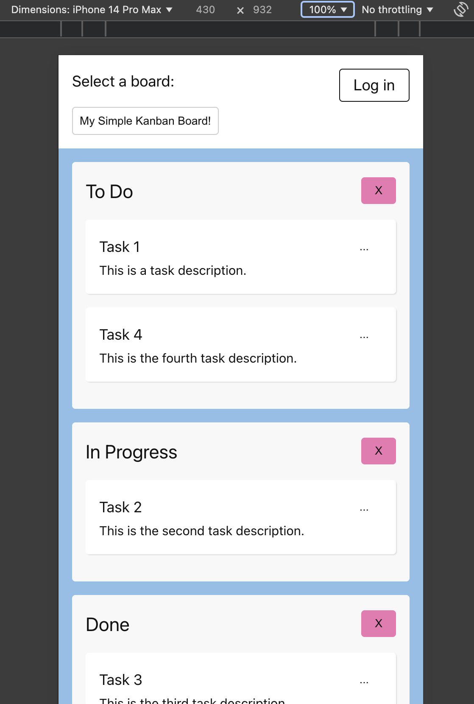

# Overwiew

This project is a simple web application written in Vue.js (3) for creating your own digital Kanban Boards.  
A Kanban board is a visual project management tool that helps teams organize and track their work. It typically consists of columns representing different stages of a workflow, with tasks or work items represented as cards that move across these columns as they progress.
The backend part will be located in a separate repository.

<p align="middle">
<video src="https://github.com/kwilczyn/easy_kanban/blob/main/animation.mov" height="300"></video> 
</p>

Currently the project is in a very early phase. It is possible now to:

- see the first design look for the desktop and mobile devices
- see the animations for the basic actions like deleting lists from the board
- perform a few basic CRUD operations on the predefined test data

## Recommended IDE Setup

[VSCode](https://code.visualstudio.com/) + [Volar](https://marketplace.visualstudio.com/items?itemName=Vue.volar) (and disable Vetur).

## Customize configuration

See [Vite Configuration Reference](https://vitejs.dev/config/).

## Project Setup

```sh
npm install
```

### Compile and Hot-Reload for Development

```sh
npm run dev
```

### Compile and Minify for Production

```sh
npm run build
```

### Run Unit Tests with [Vitest](https://vitest.dev/)

```sh
npm run test:unit
```

### Run End-to-End Tests with [Playwright](https://playwright.dev)

```sh
# Install browsers for the first run
npx playwright install

# When testing on CI, must build the project first
npm run build

# Runs the end-to-end tests
npm run test:e2e
# Runs the tests only on Chromium
npm run test:e2e -- --project=chromium
# Runs the tests of a specific file
npm run test:e2e -- tests/example.spec.ts
# Runs the tests in debug mode
npm run test:e2e -- --debug
```

### Lint with [ESLint](https://eslint.org/)

```sh
npm run lint
```
